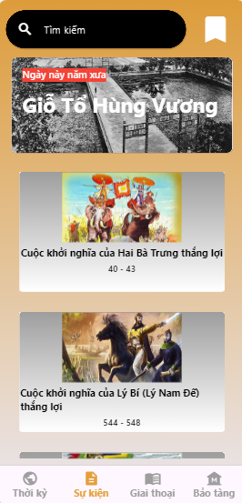
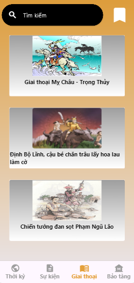
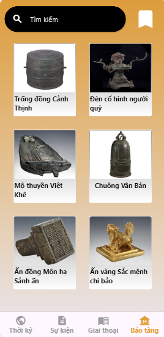

# applichsu
This is an app about Vietnamese history, made by a team of 2 people:
- Quang : https://github.com/thequang-ntq
- Thiên : https://github.com/azthienaz/applichsu

## Table of Contents

- [Features](#features)
- [User Interface](#user-interface)
- [Screenshots](#screenshots)
- [Download](#download)
- [Time-tracking](#time-tracking)
- [Future Work](#future-work)

## Features

* Advanced app that help us know more about Vietnamese history

## USER INTERFACE

-- Not have yet --

## Screenshots

| Waiter                               | | Period                                    |
|---------------------------------     | | ----------------------------------------  |
|  | |  | 

| Event                                   | | Anecdote                                     |
|-------------------------                | |----------------------------------------      |
|  | | |

|Museum                                     |
|---------------------------------------    |
|  |

## Download
Download the Android version of this app through the following link:
-- Not have yet --

## Time Tracking

| Date         | Task                   | Notes                                               |
|--------------|---------------------   |-----------------------------------------------------|
| 16/07/2024   | Project setup          | Get started with project                            |
| 17/07/2024   | Update Waiter UI       | Update the Waiter UI                                |
| 18/07/2024   | Update Main: Period UI | Update the Period UI                                |
| 19/07/2024   | Update Main and Constants Event, Anecdote, Museum Page UI | Update more basic UI|
| 20/07/2024   | Fix Navigate Page, Update 4 Period Details Page + Constants Period Details Page + Contact Page | Update more basic UI |

##### Future Work
- [ ] Update app structure, optimize and clean code.
- [ ] Using SQL database for this app
- [ ] UI : Design the UI better, cleaner