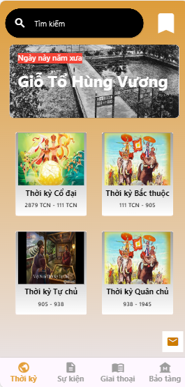

# applichsu
This is an app about Vietnamese history, made by a team of 3 people:
- Nguyễn: https://gitlab.com/mucdong
- Quang : https://gitlab.com/thequang-ntq
- Thiên : https://gitlab.com/thienlp2609

## Table of Contents

- [Features](#features)
- [User Interface](#user-interface)
- [Screenshots](#screenshots)
- [Download](#download)
- [Time-tracking](#time-tracking)
- [Future Work](#future-work)

## Features

* Advanced app that help us know more about Vietnamese history

## USER INTERFACE

-- Not have yet --

## Screenshots

| Waiter                               | ............ | Period                                    |
|---------------------------------     | ----------------- | ----------------------------------------  |
|  | ............... |  | 

| Event                                   | .............. | Anecdote                                     |
|-------------------------                | --------------- |----------------------------------------      |
|  | .............. | |

|Museum                                     |
|---------------------------------------    |
|  |

## Download
Download the Android version of this app through the following link:
-- Not have yet --

## Time Tracking

| Date         | Task                   | Notes                                               |
|--------------|---------------------   |-----------------------------------------------------|
| 16/07/2024   | Project setup          | Get started with project                            |
| 17/07/2024   | Update Waiter UI       | Update the Waiter UI                                |
| 18/07/2024   | Update Main: Period UI | Update the Period UI                                |
| 19/07/2024   | Update Main and Constants Event, Anecdote, Museum Page UI | Update more basic UI|
| 20/07/2024   | Fix Navigate Page, Update 4 Period Details Page + Constants Period Details Page + Contact Page | Update more basic UI |
| 21/07/2024   | Update Bookmark UI, Search Suggestions | Update more basic UI and Search Suggestions |
| 22/07/2024   | Update Search Page, Fix SearchBar UI   | Update more basic UI                |
| 23/07/2024   | Switch Code to GitLab, learn about trello   |  Learning             |
| 24/07 - 25/07/2024  | Update New Pages for Museum - Anecdote - Event Widgets, HV Pages, Period Details 1-2 Pages  |  Update more basic UI             |
| 26/07/2024   | Update Period Details 3-4 Pages, Fix Bookmark Page, Search Page | Complete basic UI  |
| 27/07/2024   | Update Contact Page                    | Complete basic UI              |
| 28/07/2024   | Update Video Page                      | Complete basic UI              |
| 29/07/2024   | Update outer part UI                   | Thiên: Update outer part UI    |
| 30/07/2024   | Optimize code, Update inner part UI    | Quang: Update inner part UI    |
##### Future Work
- [ ] Update app structure, optimize and clean code.
- [ ] Using SQL database for this app
- [ ] UI : Design the UI better, cleaner